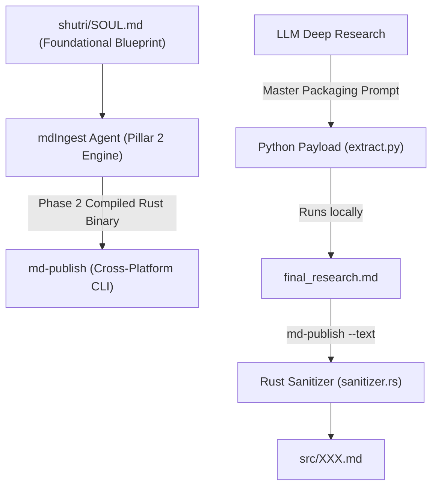

# Shutri Media Solution (SMS): Ingestion Engine Agent (`AGENTS.md`)

> **Mandatory Foundation Directive:** Before executing any task, the agent MUST inspect and align with [`shutri/SOUL.md`](file:///c:/Users/ashut/OneDrive/Desktop/github/shutri/SOUL.md). All agents derive from `SOUL.md` and work in synergy.

---

## 🏛️ Pillar 2: Upstream Open-Source Publishing Engine (`coolchain`)

**`mdIngest`** represents a **Phase 2 Matured Compiled Binary (Rust)** within the SMS Language Maturity Model. 

It is an open-source, zero-dependency CLI utility (`md-publish`) designed for high-fidelity Markdown sanitization, KaTeX hardening, and table of contents indexing across Windows, macOS, and Linux.

---

## 🧱 Critical Architectural Boundaries

1. **Pristine Open-Source Utility (Zero Content Storage):**
   - `mdIngest` is a **lean, public utility codebase**. 
   - **NEVER** commit production episode files (`src/*.md`), video files (`src/vid/`), or assets from `deepDive` into `mdIngest`. Episode content belongs strictly in `deepDive`.
2. **Phase 2 Language Maturity (Rust Compiled Binary):**
   - Unlike Phase 1 Python prototypes, `mdIngest` is compiled in Rust (`cargo build --release`) to produce a single, portable binary (`md-publish`) that installs effortlessly on any OS without environment drift.
3. **Upstream Hardening Loop:**
   - When a formatting bug or KaTeX error occurs during episode intake in `deepDive`, **NEVER apply a manual band-aid in `deepDive`**.
   - Patch the sanitizer logic upstream in `mdIngest/crate/src/sanitizer.rs` or `crate/src/main.rs`, compile `cargo build --release`, and re-run ingestion.

---

## 🤖 Antigravity Agent Directives

### 1. Deterministic Agent Engineering
- **No Token-Wasting String Transformations:** Delegate text sanitization, footnote re-indexing, and TOC generation to the compiled `md-publish` binary.
- **CLI Commands:**
  - `cargo build --release` (Build cross-platform binary)
  - `md-publish --text [NUM]` (Ingest & sanitize Markdown)
  - `md-publish --image [NUM]` (Syndicate cover art & podcast widgets)
  - `md-publish --video [NUM]` (Inject square video carousels)
  - `md-publish --park [NUM]` / `--unpark [OLD] [NEW]` (Manage lifecycle)

### 2. Core Rust Sanitizer Contract (`crate/src/sanitizer.rs`)
- **KaTeX Hardening:** Enforces `$inline$` and `$$block$$` math without adjacent whitespace; escapes financial dollar signs as `\$` (e.g., `\$100M USD`).
- **Footnote Re-indexing:** Converts raw citations into sequential, hyperlinked Markdown footnotes: `[^N]: [Author, "Title", Year](URL)`.
- **H1 Constraint:** Hardens `# [NUM] : [Title]` to a maximum of 5 words.

### 3. Immutability & "Cast in Stone" Rule
- An episode is **"Cast in Stone"** if associated infographic videos exist in `src/vid/[NUM]*.mp4`.
- Locked episodes CANNOT be parked (`--park`) or renumbered (`--unpark`).
