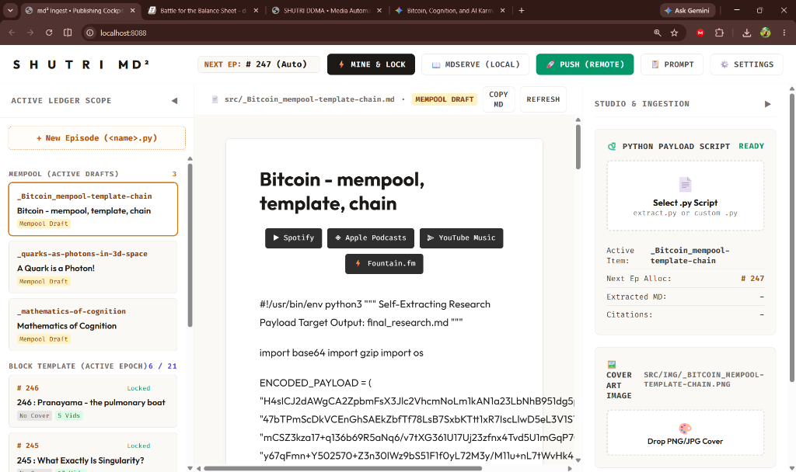

# md² (The mdd Engine & Publishing Cockpit)

> **md²** (pronounced *md-squared*) stands for **mdBook deepDive**. Much like `vim` is a recursion of `vi`, **md²** is a recursive evolution of the `mdbook` ecosystem, transformed into an opinionated, multi-modal publishing web application for the **Personal Knowledge Blockchain**.

---



---

## The Philosophy: Personal Knowledge Blockchain

In the age of LLMs, the cost of generating information has collapsed to zero, but the cost of maintaining **Signal** has skyrocketed. Most research dies in transient chat windows. 

**md²** provides a formal framework to organize research into an immutable ledger of discovery:

* **Block 0 (The Genesis Block):** The hardcoded rules of your universe. It contains the **Six Foundational Pillars** (e.g., Bitcoin, Intelligence, Physics) that anchor all subsequent research.
* **Knowledge Blocks (Block 1, 2, ...):** Chronological epochs of discovery. Each block is limited by the **Law of 21**; once the 21st episodic transaction is mined, the block is sealed into the permanent chain.
* **The Mempool:** The volatile staging zone for unmined research drafts (`src/_<slug>.md`).
* **The Block Template:** The active mining epoch holding verified episodes awaiting block seal.

---

## The md² Publishing Cockpit (Web Application)

`mdIngest` includes a standalone, zero-dependency desktop web application styled in the **Shutri.com Minimalist Editorial design system** (`#fbf9f5` warm sand canvas, `#e7e5e4` stone borders, `#d97706` amber accents, and `#1c1917` ink typography).

### 1. 3-Pane Modular Workspace

* **Left Pane (Active Ledger Scope):**
  * **Mempool Drafts:** Visual list of active drafts (`src/_<slug>.md`) with live status indicators.
  * **Two-Way Inline Title Editor:** Hover `✏️` or double-click to edit summary titles with real-time 5-word limit badges. Auto-saves and synchronizes `SUMMARY.md` instantly.
  * **Draft Management:** 1-Click `🗑️` deletion for unmined drafts with automatic tree reconciliation.
  * **Block Template & Chain Archive:** Visual inspection of active epoch episodes and historical Genesis blocks.
  * **Collapsible & Expandable:** Toggle via edge tabs (`LEDGER` / `STUDIO`) or keyboard shortcuts (`[` and `]`).

* **Central Pane (Live Editorial Preview):**
  * **Absolute KaTeX Pipeline:** High-fidelity mathematical formula rendering ($\mathbb{R}, \mathbb{C}, \mathbb{H}, \mathbb{O}$, Dirac spinors, quaternions, and matrices) with delimiter hardening.
  * **Clean Paper Typography:** Seamless reading experience matching physical book aesthetics.
  * **Podcast Syndication Strip:** Live preview links for Spotify, Apple Podcasts, YouTube Music, and Fountain.fm.

* **Right Pane (Studio & Ingestion):**
  * **Lossless `.py` Payload Extractor:** AST-driven Python script unpacker with live metadata diagnostics and citation counters.
  * **Single-Asset Store Discovery:** Automatically discovers 740×740 square video clips and cover art across both `src/vid/` and DDMA single-asset archives.

* **Top Command Bar:**
  * **`⚡ Mine & Lock`:** 1-Click atomic mining—allocates the next sequential episode number (e.g. `# 247`), updates `SUMMARY.md`, and moves the draft into the Block Template.
  * **`🟢 mdserve:3000` (Two-Way Toggle):** Starts/stops the local `mdbook serve` process on `0.0.0.0:3000` with live port probing.
  * **`🚀 Push (Remote)`:** Stages, commits, and pushes changes to your remote Git repository with automated semantic messages.
  * **`📋 Prompt`:** One-click clipboard copy of the canonical Master Packaging Prompt.
  * **`⚙️ Settings`:** Manage podcast URLs and publishing word limits.

---

## Quick Start: Launching the Cockpit

### Windows 1-Click Launcher
Double-click `start_ui.bat` or run:
```cmd
start_ui.bat
```

### Universal Launch (macOS / Linux / Windows)
```bash
python ui/server.py
```
This opens `http://localhost:8088` in your browser.

---

## The Master Packaging Prompt

*Copy this into Google Gemini, Claude, or ChatGPT to generate a 100% lossless self-extracting payload:*

```text
Objective: Package the complete exhaustive research from this session into a self-extracting Python script without summarizing or pruning.

1. Packaging Requirements:
* Full Fidelity: Package the exhaustive research in its entirety. Do not summarize or prune.
* Absolute KaTeX: Wrap all mathematical notation and symbols in Absolute KaTeX delimiters: $...$ for inline and $$...$$ for block displays. Never leave whitespace adjacent to '$'. Escape financial dollar amounts as \$ (e.g. \$100M).
* Hyperlinked Bibliography: Format every entry in the "Works Cited" section as a clickable Markdown link: [^N]: [Author, Title, Year](URL).
* Title Header: Ensure the document begins with a strict H1 title adhering to a 5-word maximum limit: # [Title].

2. Python Script Format:
Create an executable Python script where the full exhaustive research markdown is stored in raw_markdown:

raw_markdown = """
# [Title]

[Insert complete exhaustive markdown research here with $inline$ and $$block$$ math and [^1] citations...]
"""

if __name__ == '__main__':
    with open('final_research.md', 'w', encoding='utf-8') as f:
        f.write(raw_markdown)
    print("✅ Extracted final_research.md successfully.")
```

---

## The Underlying Rust Preprocessor (`md-publish`)

For automated headless CI/CD builds, `mdIngest` includes the high-performance `md-publish` Rust binary.

### Build & Installation:
```bash
# Build the Rust preprocessor
cargo build --release

# Add to system PATH
cp target/release/md-publish /usr/local/bin/
```

### `book.toml` Configuration:
```toml
[preprocessor.ingest]
command = "md-publish"
downloads_path = "/path/to/downloads"
video_source = "/path/to/video/archive"
lightning_address = "yourname@primal.net"
title_word_limit = 5
```

---

## Safety & Integrity Mechanisms

To ensure `SUMMARY.md` is never corrupted:
1. **Automated Pre-Write Backups:** `server.py` writes rolling timestamped snapshots to `ingest/backups/SUMMARY_<timestamp>.md.bak` before every write.
2. **Surgical AST Section Isolation:** Reconstructs Mempool and Block Template sections while keeping Genesis Pillars and Header links 100% immutable.
3. **Git Atomic Versioning:** Every transaction is tracked in Git with 1-click rollback.

---

## License
Licensed under [CC0 1.0 Universal](https://creativecommons.org/publicdomain/zero/1.0/). Build the future.
