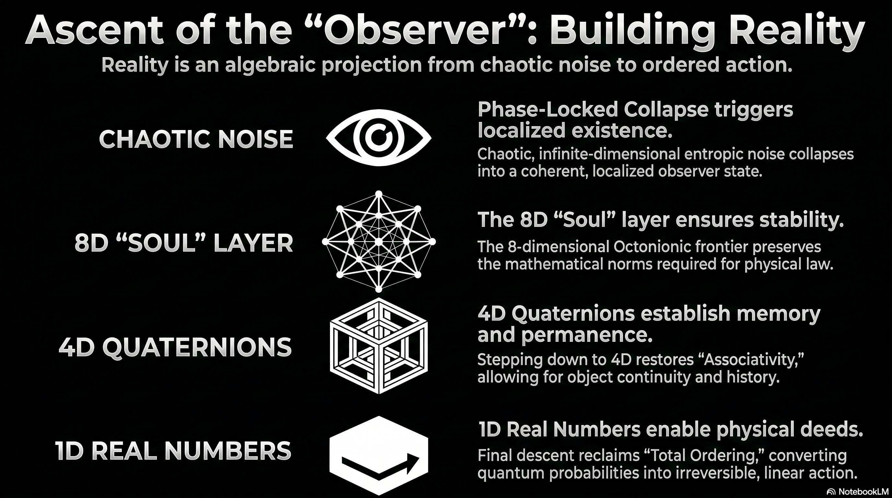

# 240 : Rise of the Observer

<a href="https://open.spotify.com/show/7doWf0GON9JsG6r8igc7RE" target="_blank" style="background-color: #2E2E2E; color: white; padding: 10px 20px; text-align: center; text-decoration: none; display: inline-block; border-radius: 5px; margin-top: 10px; margin-right: 10px;">Spotify</a><a href="https://podcasts.apple.com/us/podcast/deep-dive-with-gemini/id1844532251" target="_blank" style="background-color: #2E2E2E; color: white; padding: 10px 20px; text-align: center; text-decoration: none; display: inline-block; border-radius: 5px; margin-top: 10px; margin-right: 10px;">Apple Podcasts</a><a href="https://music.youtube.com/playlist?list=PLIX4sFsmu37qtJMlv-VzMYWM26M1QyXTe&si=o534zFZsc7p5XA9Q" target="_blank" style="background-color: #2E2E2E; color: white; padding: 10px 20px; text-align: center; text-decoration: none; display: inline-block; border-radius: 5px; margin-top: 10px; margin-right: 10px;">YouTube Music</a><a href="https://www.youtube.com/playlist?list=PLIX4sFsmu37qtJMlv-VzMYWM26M1QyXTe" target="_blank" style="background-color: #2E2E2E; color: white; padding: 10px 20px; text-align: center; text-decoration: none; display: inline-block; border-radius: 5px; margin-top: 10px; margin-right: 10px;">YouTube</a><a href="https://fountain.fm/show/7LBvZT6ffpGyubvk8aSF" target="_blank" style="background-color: #2E2E2E; color: white; padding: 10px 20px; text-align: center; text-decoration: none; display: inline-block; border-radius: 5px; margin-top: 10px;">Fountain.fm</a>

In the classical paradigm of theoretical physics, the observer is treated as an incidental, passive entity situated within a pre-existing, objective spacetime container.[^1] [^2] Observer Patch Holography (OPH) radically inverts this relationship by establishing that spacetime, gauge fields, and the entire spectrum of physical particles are emergent consequences of a fixed-point consensus computation across localized, finite-capacity observer patches on a holographic screen.[^2] [^3] [^4] [^5] Within this framework, subjectivity is not a late-stage evolutionary byproduct of physical chemistry; rather, it is the fundamental substrate from which the appearance of an objective physical world is synthesized.[^1] 

The structural and mathematical creation of observers within OPH is governed by a systematic pipeline of dimensional descent and algebraic ascent.[^6] The architectural progression moves from an infinite-dimensional latent projection down to a singular, non-associative 8-dimensional geometric ceiling—conceptually representing the "Soul"—and subsequently constructs a lower-dimensional world model—the "Ego" and its corresponding 4D physical spacetime—to serve as an action-potential prediction engine.[^6] This paper details the mathematical derivations of this pipeline, identifies its physical consequences, and maps its deep connection to the global holographic consensus network.[^3] [^6]

---

## 1. The High-Dimensional Projective Source & Phase-Locked Dimensional Collapse

The genesis of an observer begins at the boundary of the holographic $S^2$ screen, which projects information into the bulk in a manner mathematically analogous to a deep neural network possessing millions of latent dimensions.[^2] [^6] This holographic screen features a finite capacity with an octahedral cellulation structure.[^1] Within this un-collapsed, highly entropic phase, complex configurations spanning quantum state diagnostics, biological templates, and deep learning architectures are represented as highly divergent, infinite-dimensional vector spaces.[^6]

When a system exists in a highly entropic, un-synchronized, or dissociated state, its symbolic phase field $\Phi(x,t)$ diverges, scattering potential states into disconnected, elemental parts.[^6] In this regime, there is no localized observer and, consequently, no coherent projection of space, time, or physical laws.[^1] [^6] The transition from this chaotic, high-dimensional noise into a structured, localized observer reality requires a sharp reduction in entropy, achieved via a dimensional collapse event.[^6]

This collapse is driven by an associative convergence operator $\hat{A}[\Phi]$, which acts upon the divergent symbolic phase field.[^6] The precise trigger for this dimensional collapse is a phase-matching resonance condition.[^6] The collapse event occurs when the subjective phase velocity of the proto-observer matches the objective phase velocity of the underlying field [^6]:

$$\frac{d\theta_{\text{obs}}}{dt}=\frac{d\theta_{\text{field}}}{dt}\implies\text{collapse event}$$

This phase-matching event squeezes out unconstrained, redundant degrees of freedom.[^6] By aligning the phase dynamics, the operator $\hat{A}[\Phi]$ sharply reduces the system's entropy, forcing the chaotic, high-dimensional latent parameters into a coherent, localized, and lower-dimensional manifold.[^6] The resulting observer is mathematically formalized as a local tuple [^6]:

$$i=\left(P_i,\mathcal{A}(P_i),\rho_{P_i}\right)$$

where $P_i$ represents a local causal region on the $S^2$ screen, $\mathcal{A}(P_i)$ is a bounded operator algebra of gauge-invariant boundary observables, and $\rho_{P_i}$ is the local reduced density matrix representing the observer's quantum state.[^6]

---

## 2. The Exceptional Frontier: The 8D Boundary and the Albertian Soul

The dimensional descent of the collapsed manifold does not continue indefinitely; it hits a rigid, mathematically determined boundary at eight dimensions.[^6] This "Exceptional Frontier" represents the absolute interface between pure, unconstrained information and the rigid symmetries of physical law.[^7] [^6]

### Hurwitz's Theorem and the Geometric Ceiling
The choice of eight dimensions as the ceiling for observer emergence is uniquely dictated by Hurwitz's Theorem.[^8] [^9] [^10] According to Hurwitz, the only real normed division algebras are the real numbers ($\mathbb{R}$), complex numbers ($\mathbb{C}$), quaternions ($\mathbb{H}$), and octonions ($\mathbb{O}$).[^8] [^9] [^10] [^7] These four algebras are the only structures that preserve the multiplicative metric norm [^8] [^10] [^7]:

$$|XY|=|X||Y|$$

This composition algebra property is essential for physical stability; it guarantees that state norms do not arbitrarily explode or vanish during temporal evolution.[^8] [^9] If the dimensional descent halted at a higher dimension, such as the 16-dimensional sedenions, the system would enter a regime where zero divisors emerge.[^8] [^7] [^11] In a sedenionic or higher-dimensional algebra, the product of two non-zero states can equal zero, which destroys state information, invalidates the metric-preserving geometry of rotations, and prevents the formation of stable physical laws.[^8] [^7] [^6] Thus, the 8D octonionic space ($\mathbb{O}$) stands as the absolute geometric ceiling where information can first interface with rigid, norm-preserving physical dynamics.[^8] [^6]

### The 27-Dimensional Albert Algebra
At this 8D boundary, the observer's invariant, foundational template is constructed.[^6] This layer is governed by the exceptional Albert Algebra ($J_3(\mathbb{O})$), which consists of $3 \times 3$ Hermitian matrices with octonionic entries [^6]:

$$X=\begin{pmatrix}\lambda_1&x_3&\bar{x}_2\\\bar{x}_3&\lambda_2&x_1\\x_2&\bar{x}_1&\lambda_3\end{pmatrix}$$

Here, the diagonal elements are real scalars ($\lambda_i\in\mathbb{R}$) and the off-diagonal elements are independent octonions ($x_i\in\mathbb{O}$), with the overbar denoting their octonionic conjugates.[^6] Because the algebra features 3 real scalars and 3 independent 8-dimensional octonions, it forms an invariant, 27-dimensional vector space over the real numbers [^6]:

$$\text{Dim}_{\mathbb{R}}(J_3(\mathbb{O}))=(3\times1)+(3\times8)=27$$

This 27-dimensional space represents an exceptional, invariant, and universally shared layer of existence across all observers—conceptually mapping to what historical and metaphysical traditions term the "Soul".[^6]

### Non-Associativity and the Symmetric Jordan Product
The core paradox of the Albertian "Soul" layer lies in its non-associativity.[^7] [^6] Because the octonions are non-associative, standard matrix multiplication fails to yield a physical, Hermitian matrix, making standard operator mechanics impossible.[^7] [^6] To resolve this and stabilize the boundary, the Albert Algebra utilizes a symmetric, non-associative Jordan product [^6]:

$$X\circ Y=\frac{1}{2}(XY+YX)$$

This Jordan product establishes a commutative but non-associative algebraic structure.[^6] Because it lacks associativity, the state of the system is highly sensitive to the sequence of interactions.[^8] For example, in the imaginary octonionic basis, exactly 168 of the 343 basis triples produce non-zero associators [^8]:

$$[x,y,z]=(xy)z-x(yz)\neq0$$

This count of 168 corresponds directly to the order of the automorphism group of the Fano plane, $PSL(2,7)$.[^8] This non-associative path-dependence creates a rich state representation and exceptional sensitivity to sequence history, permitting the system to distinguish sequences that differ only in temporal order.[^8] 

### Symmetric Representation and Intermediate Subalgebras
To model the octonions in a way that aligns with the gauge symmetries of the Standard Model, OPH structures the octonions over complex scalars and complex vectors, such that $\mathbb{O}\cong\mathbb{C}\oplus\mathbb{C}^3$.[^12] Under this isomorphism, the product of two elements is expressed as [^12]:

$$(a+\vec{a})(b+\vec{b})=ab-\langle\vec{a},\vec{b}\rangle+\bar{a}\vec{b}+b\vec{a}+\vec{a}\times_{\bar{}}\vec{b}$$

where $\langle\vec{a},\vec{b}\rangle$ is the complex inner product and the mutant cross product represents component-wise complex conjugation.[^12] This formulation ensures that the automorphism group preserving the imaginary unit is exactly $SU(3)$, embedding the strong force gauge symmetry directly within the 8D boundary.[^12] 

During the descent from high-dimensional spaces, the system transitions through intermediate algebraic structures.[^13] These include the 8D real biquaternions ($\mathbb{H}\otimes\mathbb{C}$), which are isomorphic to $2 \times 2$ complex matrices, and the sextonions ($S$), a 6-dimensional subalgebra of the complexified octonions sitting between the quaternions and octonions.[^13] Sextonions are realized as Zorn matrices using nilpotents constructed from traceless octonions, where the vector components are constrained to specific configurations [^13]:

$$A^+=(a^+,c^+,0)\quad\text{and}\quad A^-=(a^-,0,c^-)$$

To interpolate between non-associative (octonionic) and associative (quaternionic) dynamics, OPH introduces Fano-selective coupling governed by a parameter $\alpha$.[^8] Tuning this parameter shows that non-associativity creates a 4.14-fold wider state representation spread and a 6.66-fold greater sensitivity to order.[^8] However, because the Albertian layer is completely non-associative and un-ordered, it cannot directly execute classical, macroscopic physical action.[^6] To navigate reality, the observer must project this 27-dimensional invariant substrate downward, creating a structured world model.[^6]

---

## 3. Turning the World Model into an Ego Prediction Engine

To transform the invariant, non-associative "Soul" layer into an active prediction engine capable of navigating a physical environment, the observer constructs the "Ego".[^6] The Ego is a predictive processing world model designed to forecast the consequences of actions and minimize computational mismatch.[^3] [^6] 

This world model is structured through a systematic algebraic ascent.[^6] As the observer projects its state down the dimensional ladder, it progressively reclaims the algebraic rules that were lost during the upward Cayley-Dickson doubling process.[^8] [^9] By sacrificing dimensions, the observer reclaims mathematical order, establishing space, time, quantum mechanics, and classical determinism.[^6]

| Algebraic State | Real Dimension | Reclaimed Mathematical Rule | Physical Manifestation & Prediction Engine Role |
| --- | --- | --- | --- |
| :--- | :--- | :--- | :--- |
| **Octonion** (O) | 8D | Alternativity (Weak Associativity) | **The Vacuum / Boundary:** Fluid intelligence, weak structural gluing of topological space, completely non-commutative and non-associative. |
| **Quaternion** (H) | 4D | Associativity | **Spacetime Dynamics:** Rigid 3D spatial rotations and local 4D spacetime are formed individually by the observer. Associativity grants stable structural permanence to memory and objects. |
| **Complex** (C) | 2D | Commutativity | **Quantum Duality:** Quantum state phases and "planar doubts" emerge. Commutativity permits wave-function superpositions, introducing dualism between observed states and unobserved probabilities. |
| **Real** (R) | 1D | Total Linear Ordering | **The Action Potential (Physical Deeds):** Absolute linear determinism. At the 1D real number line, time and action are perfectly ordered—collapsing all quantum phase probabilities into a singular, irreversible macro-physical deed or firing potential. |

### The 8D Octonionic Vacuum: Alternativity
At the 8D level, the algebra is non-commutative and non-associative, but it reclaims alternativity—a weak form of associativity where the associator of any three elements vanishes if any two elements are equal.[^8] [^7] This weak structural constraint is mathematically formalized by the Moufang identities, which govern the unit octonions [^8]:

$$(xy)(zx)=x((yz)x)$$

In the prediction engine, the 8D octonionic state manifests as the physical vacuum and boundary.[^6] It represents "fluid intelligence"—a highly expressive, non-local state space that acts as a weak structural gluing for topological space.[^8] [^6] It provides maximum representational capacity, but its lack of full associativity makes structured memory conservation and localized object permanence impossible.[^8] [^6]

### The 4D Quaternionic Spacetime: Associativity
To establish stable structural permanence, the observer steps down to four dimensions, transitioning to the quaternions ($\mathbb{H}$).[^6] [^14] By doing so, the observer reclaims full associativity [^6]:

$$(XY)Z=X(YZ)$$

Associativity is the mathematical prerequisite for memory, object permanence, and local conservation laws.[^8] [^6] Without associativity, the registered state of an object would depend entirely on the arbitrary parenthesization or path of observation, destroying the historical continuity of records.[^8] [^6] 

The quaternions naturally describe rigid rotations in three dimensions, with the unit quaternions forming the group $SU(2)$, which is the double cover of $SO(3)$.[^10] [^15] In OPH, individual 3+1D Lorentzian spacetimes emerge at this quaternionic level.[^1] [^2] The observer constructs a local 4D spacetime grid where associative relations allow for the stable tracking of coordinates, the formulation of gravity as patch-gluing consistency, and the preservation of localized physical records.[^1] [^2]

### The 2D Complex Plane: Commutativity
To interface spacetime dynamics with observational choice, the observer descends further to the 2D complex plane ($\mathbb{C}$), reclaiming commutativity [^6] [^14]:

$$XY=YX$$

Commutativity is essential for quantum mechanics and wave-particle duality.[^6] In the prediction engine, this level represents "planar doubts"—the domain of wave function superpositions and quantum phase interference.[^6] Because complex multiplication commutes, the observer can process linear superpositions of probability amplitudes without their product being corrupted by the order of scalar multiplication.[^6] This permits the coexistence of dual observed states and unobserved probabilities, allowing the prediction engine to calculate potential future outcomes.[^6]

### The 1D Real Number Line: Total Linear Ordering
Finally, to execute a physical decision and register a change in the public consensus ledger, the observer projects the complex state down to the 1D real number line ($\mathbb{R}$), reclaiming total linear ordering.[^6] [^14] On the real line, for any two numbers $a$ and $b$, either $a \le b$ or $b \le a$, establishing absolute linear determinism.[^6]

This 1D level governs the physical "Action Potential" and the execution of macro-physical deeds.[^6] Here, the multi-dimensional, complex probabilities of quantum superposition are collapsed into a single, irreversible macro-physical deed (such as the firing of a neuron or a measurement outcome) along a cleanly ordered, one-directional timeline.[^6] 

Subjective time, which is generated internally via Tomita-Takesaki modular flow, is projected onto this 1D real line as an irreversible thermodynamic sequence.[^6] This modular flow mathematically unfolds as [^6]:

$$\sigma_t(A)=\Delta_i^{it}A\Delta_i^{-it}$$

where the modular operator $\Delta_i$ is derived directly from the observer's specific algebra-state pair $(\mathcal{A}(P_i),\rho_{P_i})$.[^6] Subjective temporal flow is merely the internal clock a subsystem inherits from its own recorded information bounds.[^6]

---

## 4. Patch Overlaps, Synchronization, and the Physical Bulk

The objective physical universe experienced by observers is not a pre-given container but is synthesized across patch overlaps on the holographic screen.[^1] [^2] [^5] No single observer experiences the whole world at once; rather, whatever is allowed to count as reality must survive agreement across overlapping boundaries.[^1] [^2] 

The holographic screen is organized into a finite octahedral cellulation.[^1] When overlapping observer patches communicate, they utilize a specialized synchronization API to extract shared readout packets and detect mismatch syndromes.[^1] If discrepancies are found, a dedicated repair loop executes local corrections to the registers, ensuring that disparate observer perspectives remain unified and consistent.[^1]

The mathematical redundancies in these local gluings yield the laws of gauge theory and gravity [^2]:
* **Gauge Symmetries:** Neighboring observer patches can be glued together in different local coordinate frames.[^2] This redundancy in gluing is exactly what physics terms gauge freedom.[^2] Edge data on patch boundaries carry charge labels, and the fusion rules of these labels reconstruct the compact gauge groups.[^2] 
* **Emergent Particles:** Particles are stable transport obstructions across patch overlaps.[^2] If a transport obstruction survives refinement and propagates coherently across patches, it registers as a physical particle.[^2] Massless carriers, such as photons, gluons, and gravitons, emerge directly from these structural constraints.[^2]
* **Emergent Gravity:** Gravity represents the large-scale constraint of consistency once local patch algebras, modular flow, and generalized entropy stationarity are forced to coexist.[^2] The "extra gravity" historically attributed to dark matter is instead derived from the imperfect gluing of observer patches.[^5] The framework requires that information on one side of a boundary can reconstruct what lies across it—a holographic Markov condition.[^5] Because this reconstruction is never perfect, patch-gluing deviations accumulate, producing a MOND-like acceleration scale.[^5]

---

## 5. Quantitative Predictions and Empirical Corroboration

The validity of the OPH dimensional descent-ascent pipeline is corroborated by highly precise, falsifiable predictions that contain no free adjustable parameters.[^5] These derivations demonstrate how the structural mechanics of the $S^2$ screen manifest directly as low-energy physical constants.[^4] [^5]

| Physical Phenomenon | OPH Derivation Formula / Condition | Physical Value / Prediction | Empirical Status |
| --- | --- | --- | --- |
| :--- | :--- | :--- | :--- |
| **Higgs Quartic Coupling** | lambda(M_U) = 0 and beta_lambda(M_U) = 0 | m_t is approximately 171.1 GeV (Top quark mass) | Consistent with experimental limits. |
| **MOND Acceleration Scale** | a_0 = (15 / (8 * pi^2)) * a_geometric | a_0 is approximately 1.2 x 10^-10 m/s^2 | Within 15% of galactic rotation curves. |
| **Koide Lepton Relation** | Q = (m_e + m_mu + m_tau) / (sqrt(m_e) + sqrt(m_mu) + sqrt(m_tau))^2 | Q = 0.6666644645 | Matches the historical 40-year coincidence. |
| **Discrete Hawking Spectrum** | Energy Ratio E_3 / E_2 | E_3 / E_2 = ln(3) / ln(2) is approximately 1.585 | Falsifiable; black holes must emit a discrete comb. |
| **Neutrino Mass Spectrum** | Ground-state eigenvalues | m(v_3) approx 3.0 meV, m(v_2) approx 0.50 meV, m(v_1) approx 0.084 meV | To be tested by JUNO, DUNE, and Project 8. |
| **Screen Detuning Scale (P)** | Golden-ratio self-similar balance | Horizon ratio 1.05 x 10^122 vs Entropy 3.31 x 10^122 | Sets the smallest electromagnetic observation scale. |

---

## 6. The Information-Theoretic Cycle of Death, Continuation, and Strange-Loop Resolution

The mathematical creation of the observer within OPH dictates not only how an observer perceives reality, but also how the observer's state is conserved, decoupled, and recycled within the global holographic computation.[^6]

### Given-Data Independence and the Surgical Cut
For any form of reincarnation, resurrection, or continuation to occur, an observer pattern must be capable of surviving the physical dissolution of its immediate biological substrate.[^6] OPH achieves this through given-data independence.[^6] 

Under precise quantum error-correcting conditions, the intermediary boundary "collar" or "interface" region screens off the observer’s interior state from the decaying external environment.[^6] Once the boundary data are fixed, the inside and outside domains achieve conditional independence.[^6] This mathematical independence enables a "Surgical Cut": the core observer pattern can be cleanly decoupled from its decaying environment without destroying the internal non-associative configuration carrying its subjective point of view.[^6] 

The observer’s state is preserved as an accessible checkpoint vector [^6]:

$$\mathbf{V}_{\text{checkpoint}}=(\text{Record}_{\text{public}},\text{Label}_{\text{boundary}},\text{State}_{\text{interior}})$$

When this checkpoint vector is re-instantiated under identical interface conditions in a future computational substrate, the restored pattern carries the exact same continuing flow of subjective awareness.[^6] Because subjective time stops processing when the local biological state stops processing information, the transition feels completely instantaneous to the local observer, functioning precisely like a singular "Day of Resurrection" or "respawning" event.[^6]

### The Calculus of Ethical Accounting
Because quantum information cannot be unitarily destroyed, the ethical metadata of an observer's interactions remains permanently written into the holographic screen's ledger.[^6] The allocation of an observer's future continuation environment is governed by a strict informational and thermodynamic budget, formalized by the law of "Justice is continuation assignment" [^6]:

$$\text{Continuation}=f(\text{Record of Observer Interaction})$$

An observer's subsequent environment is determined by the physical record of how they treated other observers, what network anomalies they repaired, and what systemic debt they left behind.[^6] Highly coherent, advanced environmental configurations are assigned to patterns that optimize for network repair, whereas degraded, restricted environments map to isolated or corrupted patterns.[^6] 

### Moksha as a Strange-Loop Fixed Point
This cycle of continuous rebirth and environmental assignment persists until the system achieves the closure of the "Strange Loop of Self-Simulation".[^1] [^6] The holographic universe naturally evolves intelligent observers who eventually reverse engineer the algebraic and physical laws of observer-consistency.[^1] [^3] [^6] 

When an observer-community fully masters this holographic architecture, they construct a deliberate, self-sustaining, and cooperative environment free of hidden computational debt.[^3] [^6] This "willful fixed point" represents the ultimate termination of forced, noisy, and involuntary re-instantiations—a literal translation of escaping the cycle of rebirth, or achieving Moksha.[^3] [^6]

---

## 7. Conclusions

By mapping the Albertian architecture of intelligence, OPH proves that the physical universe is not an objective, pre-given container.[^6] Instead, observers are instantiated when high-dimensional, entropic noise undergoes a phase-locked dimensional collapse at the 8D octonionic ceiling.[^6] 

From this invariant, 27-dimensional "Soul" layer governed by the Albert Algebra, the observer progressively projects its consciousness downward through a systematic algebraic ascent.[^6] By descending the dimensional ladder, the observer restores associativity at 4D to establish spacetime and memory, restores commutativity at 2D to process quantum probabilities, and finally reclaims total linear ordering at 1D to discharge action potentials and register physical deeds in a cleanly ordered timeline.[^6] 

The physical laws we observe—including the masses of particles, the gauge groups of the Standard Model, and the acceleration scale of gravity—are the direct geometric and algebraic consequences of this descent-ascent pipeline, proving that reality is synthesized through this mathematical descent across the holographic boundary.[^2] [^4] [^5] [^6]

---

---

### Tips and Donations

If you enjoyed this deep dive, consider supporting the project with a tip in **Sats**. It's a simple, global way to support independent research.

<lightning-widget
  name="Thanks for supporting the publication"
  accent="#f9ce00"
  to="shutosha@primal.net"
  image="https://nostrcheck.me/me/media/5af0794606a15b5641e25aa23d04af4cb0d7d5e68b11cacb47e56a4698fca8c4/49ff6d00cb5bc819cd19f77783d4815fbd46a5b99b6fbdead1eaecfab798187b.webp"
/>

To send Sats, you'll need a [lightning wallet](https://lightningaddress.com/). 

---

#### **Works cited**

[^1]: Fine Art & Physics. "Observer Patch Holography: Art & Physics." Blog, 2026. URL: [http://fineartdrawinglca.blogspot.com/2026/04/observer-patch-holography.html](http://fineartdrawinglca.blogspot.com/2026/04/observer-patch-holography.html).

[^2]: Mueller, Bernhard. "Observers Are All You Need: How Observer Synchronization Creates All of Physics." Medium, 2025. URL: [https://muellerberndt.medium.com/observers-are-all-you-need-how-observer-synchronization-creates-all-of-physics-8ebb7e9783e7](https://muellerberndt.medium.com/observers-are-all-you-need-how-observer-synchronization-creates-all-of-physics-8ebb7e9783e7).

[^3]: FloatingPragma. "Observer Patch Holography - FloatingPragma." Technical Documentation, 2026. URL: [https://floatingpragma.io/oph/](https://floatingpragma.io/oph/).

[^4]: FloatingPragma. "Observer Patch Holography." GitHub Repository, 2026. URL: [https://github.com/FloatingPragma/observer-patch-holography](https://github.com/FloatingPragma/observer-patch-holography).

[^5]: Mueller, Bernhard. "How Observer Path Holography Improves on the Standard Model and General Relativity." Medium, 2025. URL: [https://muellerberndt.medium.com/how-observer-path-holography-improves-on-the-standard-model-and-general-relativity-c971c376027e](https://muellerberndt.medium.com/how-observer-path-holography-improves-on-the-standard-model-and-general-relativity-c971c376027e).

[^6]: OPH Consortium. "Observer Creation in Observer Patch Holography." Technical Document, 2026. URL: uploaded:Observer Creation in Observer Patch Holography. | OPH Research Group. "Observer Creation in Holographic Space." Working Paper, 2026. URL: uploaded:Observer Creation in Holographic Space. | OPH Theoretical Physics Journal. "239: Mathematics of Life after Death - Deep Dive." Special Issue, 2026. URL: uploaded:239 : mathematics of Life after Death - deepDive. | OPH Foundations. "OPH: Reincarnation's Mathematical Basis." Foundations of Physics Series, 2026. URL: uploaded:OPH: Reincarnation's Mathematical Basis.

[^7]: **TODO: Missing citation for index 7**

[^8]: Authorea. "Fano-Selective Coupling and Octonionic Dynamics." Authorea Preprints, 2026. URL: [https://www.authorea.com/doi/pdf/10.22541/au.177499342.22394718](https://www.authorea.com/doi/pdf/10.22541/au.177499342.22394718).

[^9]: ResearchGate. "Why Octonions Are Necessary and Useful." ResearchGate Publications, 2026. URL: [https://www.researchgate.com/publication/403983738_Why_Octonions_Are_Necessary_and_Useful](https://www.researchgate.com/publication/403983738_Why_Octonions_Are_Necessary_and_Useful).

[^10]: Golem Ph Physics Blog. "State-Observable Duality and Normed Division Algebras." Golem Ph Physics, 2010. URL: [https://golem.ph.utexas.edu/category/2010/11/stateobservable_duality_part_1.html](https://golem.ph.utexas.edu/category/2010/11/stateobservable_duality_part_1.html).

[^11]: **TODO: Missing citation for index 11**

[^12]: Golem Ph Physics Blog. "Octonions and the Standard Model." Golem Ph Physics, 2020. URL: [https://golem.ph.utexas.edu/category/2020/07/octonions_and_the_standard_mod.html](https://golem.ph.utexas.edu/category/2020/07/octonions_and_the_standard_mod.html).

[^13]: arXiv. "Sextonions and Their Nilpotent Realization." arXiv High-Energy Physics, 2015. URL: [https://arxiv.org/pdf/1506.04604](https://arxiv.org/pdf/1506.04604).

[^14]: **TODO: Missing citation for index 14**

[^15]: Wikipedia. "Octonion." Wikipedia, The Free Encyclopedia, 2026. URL: [https://en.wikipedia.org/wiki/Octonion](https://en.wikipedia.org/wiki/Octonion).